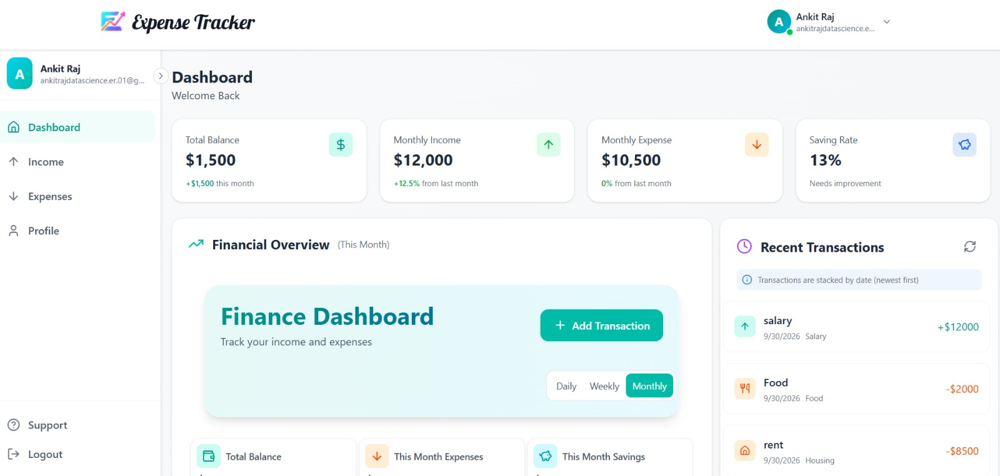
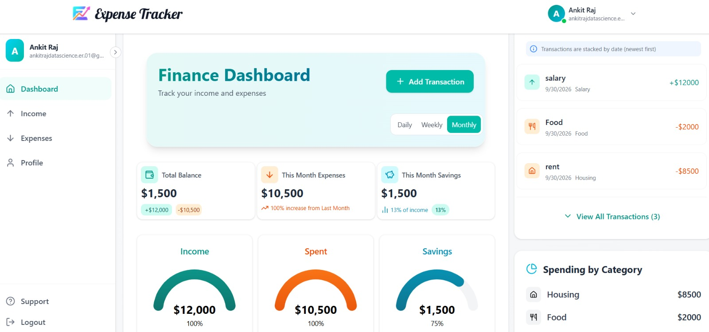
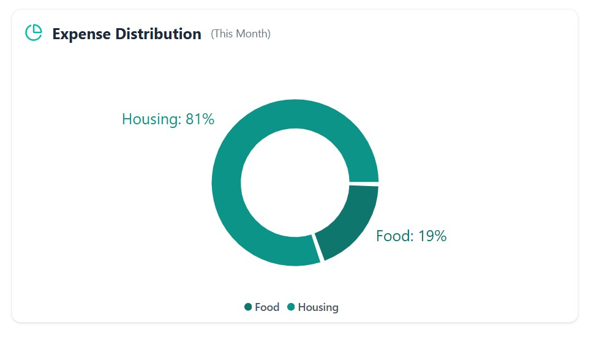
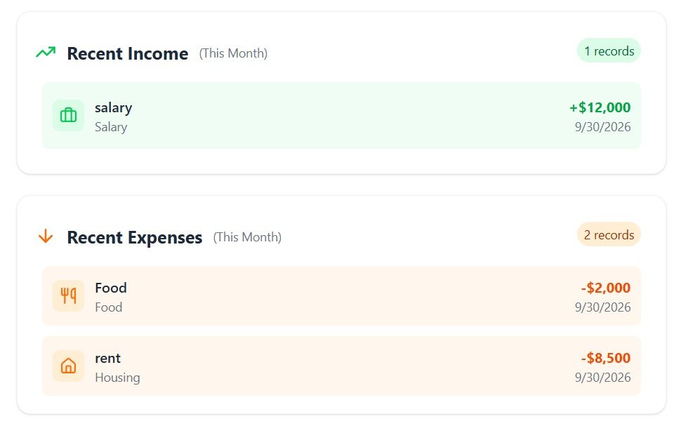

# 💰 Finance Tracker

A full-stack MERN Finance Tracker web application for managing personal income, expenses, and financial activity through a centralized dashboard.

The application provides user authentication, income and expense management, financial summaries, transaction history, and dashboard-based visualization.

---

## 📌 Project Overview

Finance Tracker is a web-based financial management application built using the MERN stack.

The application allows users to:

- Create and manage their account
- Record income and expenses
- Categorize financial transactions
- View financial summaries
- Track transaction history
- Analyze income and spending activity
- View financial information through a centralized dashboard

The project was developed and studied as part of my final-year project work, using a MERN-based reference implementation and extending my understanding of full-stack web development.

---

## ✨ Features

### 👤 User Management
- User registration and login
- Authentication-based access
- User profile management

### 💰 Income Management
- Add income transactions
- View income records
- Filter income based on time period
- Track total income

### 💸 Expense Management
- Add expense transactions
- View expense records
- Filter expenses based on time period
- Track total expenses

### 📊 Financial Dashboard
- Overview of financial activity
- Income and expense summaries
- Financial cards and visual indicators
- Recent transaction information

### 📤 Data Export
- Export financial transaction data
- Download transaction information for further analysis

---

## 🛠️ Tech Stack

### Frontend

- React.js
- JavaScript (JSX)
- CSS
- Vite

### Backend

- Node.js
- Express.js
- REST API

### Database

- MongoDB
- Mongoose
- MongoDB Atlas

### Development Tools

- Git
- GitHub
- Visual Studio Code
- Nodemon

---

## 🏗️ Application Architecture

```text
                    ┌─────────────────────┐
                    │       User          │
                    └──────────┬──────────┘
                               │
                               ▼
                    ┌─────────────────────┐
                    │   React Frontend    │
                    │      (Vite)         │
                    └──────────┬──────────┘
                               │
                         HTTP / REST API
                               │
                               ▼
                    ┌─────────────────────┐
                    │   Express Backend   │
                    │      (Node.js)      │
                    └──────────┬──────────┘
                               │
                 ┌─────────────┼─────────────┐
                 │             │             │
                 ▼             ▼             ▼
              Users         Income        Expense
              Routes        Routes         Routes
                 │             │             │
                 └─────────────┼─────────────┘
                               │
                               ▼
                    ┌─────────────────────┐
                    │       Mongoose      │
                    └──────────┬──────────┘
                               │
                               ▼


PROJECT STRUCTURE :
Finance-Tracker/
│
├── backend/
│   ├── config/
│   │   └── db.js
│   │
│   ├── controllers/
│   │   ├── dashboardController.js
│   │   ├── expenseController.js
│   │   ├── incomeController.js
│   │   └── userController.js
│   │
│   ├── middleware/
│   │   └── auth.js
│   │
│   ├── models/
│   │   ├── expenseModel.js
│   │   ├── incomeModel.js
│   │   └── userModel.js
│   │
│   ├── routes/
│   │   ├── dashboardRoute.js
│   │   ├── expenseRoute.js
│   │   ├── incomeRoute.js
│   │   └── userRoute.js
│   │
│   ├── utils/
│   │   └── dateFilter.js
│   │
│   ├── package.json
│   └── server.js
│
├── frontend/
│   ├── public/
│   ├── src/
│   │   ├── assets/
│   │   ├── components/
│   │   ├── pages/
│   │   ├── utils/
│   │   ├── App.jsx
│   │   ├── index.css
│   │   └── main.jsx
│   │
│   ├── package.json
│   └── vite.config.js
│
├── .gitignore
└── README.md ```
                    ┌─────────────────────┐
                    │   MongoDB Atlas     │
                    └─────────────────────┘


## 📸 Screenshots

### 🏠 Dashboard Overview



### 📊 Financial Summary & Analytics



### 💸 Expense Distribution



### 💰 Recent Income & Expenses


